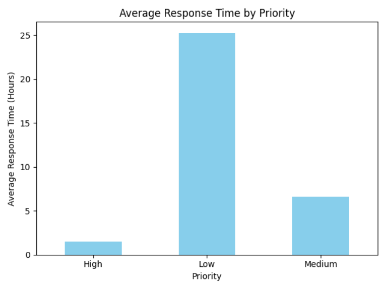

bar chart produced by code:

This project simulates a simple IT service management task, where incident response times 
are tracked and analyzed based on their priority levels (High, Medium, Low). The code reads 
incident data from an Excel spreadsheet, calculates how long it took to resolve each incident, 
groups the data by priority, and visualizes the average response times in a bar chart. The bar 
chart shows that high-priority incidents are resolved the fastest, while low-priority incidents 
take significantly longer. This analysis highlights how IT teams prioritize urgent issues for 
quicker resolution, ensuring critical services are restored promptly.
